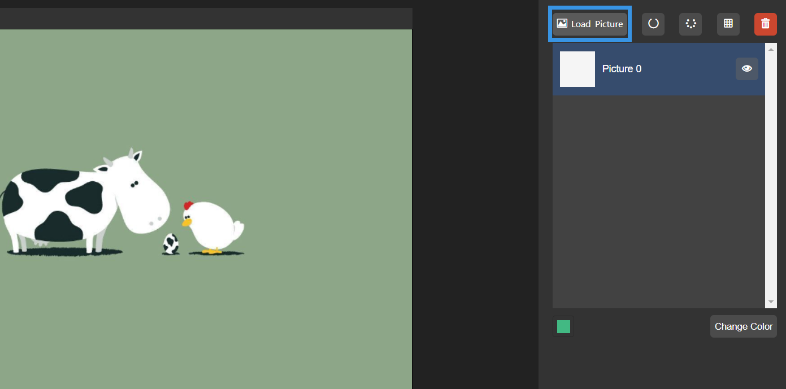
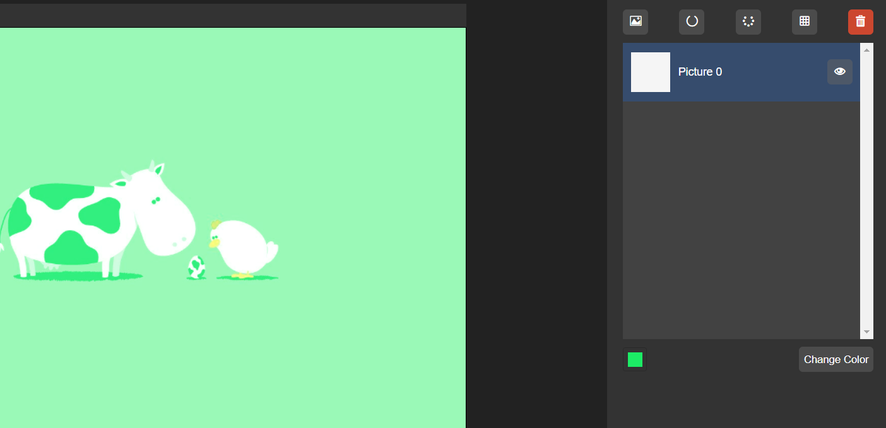
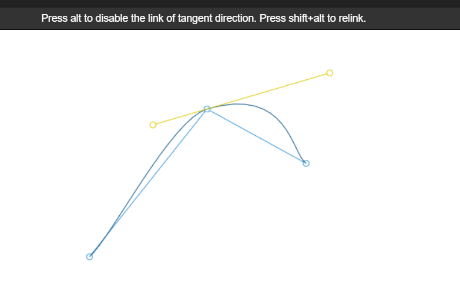
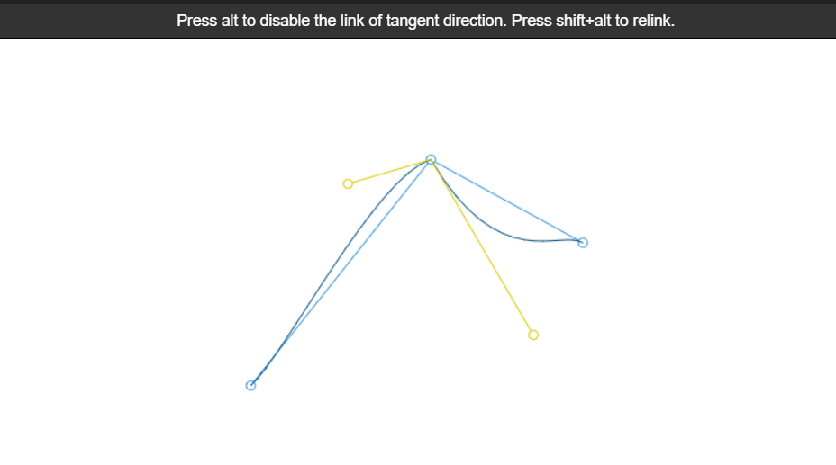
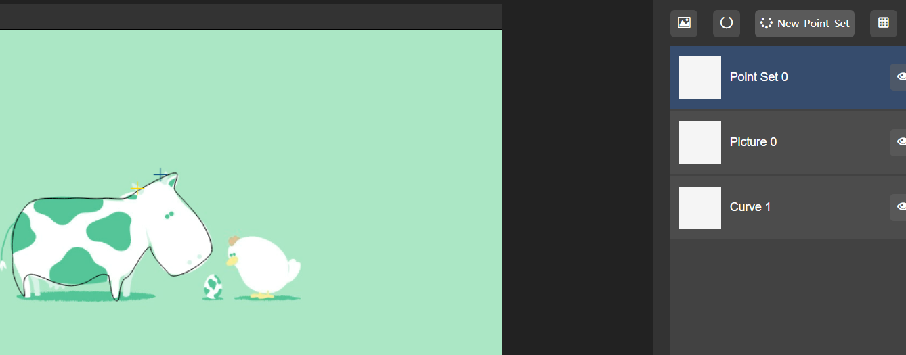
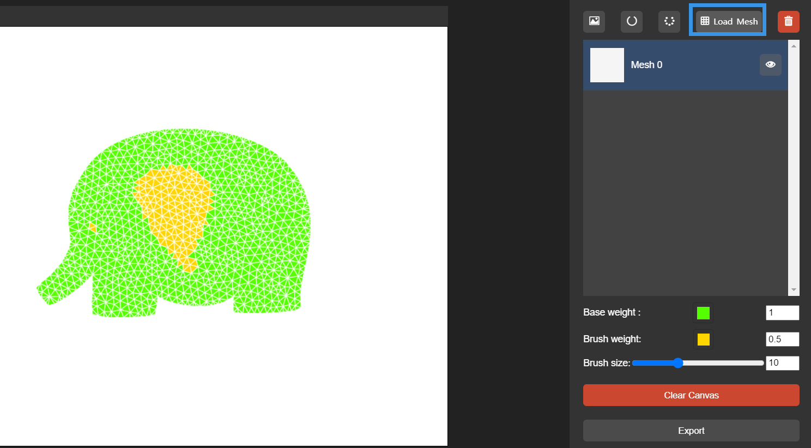
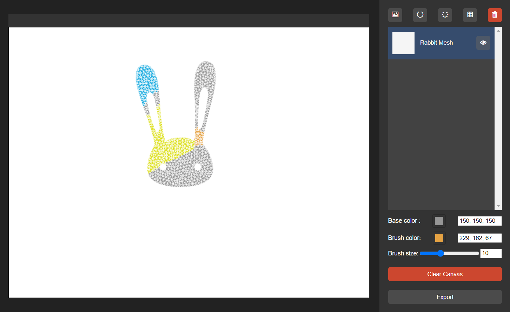
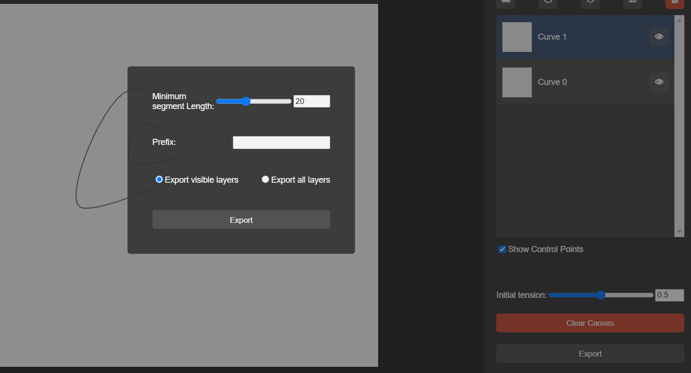

# 2D Contour Generator
This application is originally used for 2D drone design. Users can create a curve contour, assign points as positions of rotors, and paint a given triangle mesh to assign color (weights) to each little triangle.

Try it at:
https://purslaneqaq.github.io/2D-Contour-Generator/

## Layers
Users can create, delete (applies to the active layer) or hide layers.

There are four kinds of layers: Picture, Curve, Pointset and Mesh. 

Users can use 'Contour to Mesh' (a very simple program in the complex folder) to generate a mesh file from the contour.

### Picture
Load a picture from your local file to the canvas.

Change the color of the picture so it would be easier to draw on top of it

### Curve

The system would create curves based on the given points. The initial rule is similar to Catmull–Rom splines, and users can assign the initial tension. If the initial tension is 0, users can create polygons. If the initial tension is around 0.8, 4 corner points of a square would be connected to be a circle.
On the other hand, the system is actually storing the tangent (automatically calculated) and position of each point, and generating Hermite Splines. Users can always adjust the tangent of each control point by selecting it and drag the handler along its tangent.

By default, the tangents at two directions of a control point would be the same. Users can click 'alt' to unlink the directions, or shift+alt to relink the directions.

Users can close the curve by pressing 'Enter' or pushing the creating button. A curve must be closed before switching to another layer.

Users can click 'delete' to delete an active point.

By these functions, we can sketch almost any shape we want!

### Point Set
Users can create new points by clicking on the canvers and drag to move the points.(Points would be shown as crossings)

Click 'delete' to delete an active point.

### Mesh
Users can load a mesh created by the "contour to mesh" program. 
The default base weight is 1. When a triangle is not painted, it would be assigned to the base weight, otherwise it would be assigned to the brush weight.  
When changing the weight input, users need to change the **hue** on the color pannel.

If brush size is 0, only the triangle where the mouse is in would be painted. Otherwise, triangles that the distance from the center of which to the mouse is less than brush size would be painted. 

## Export
Users can export curves, point sets and painted meshes.
After exporting, curves would be treated as polygons. By defining the length of segment, users can define how smooth the polygon is.

## Integrate this with other projects
Here are 2D softdrones we created using this h5 painting tool:

Example of flying 2D soft drone:

Demo video of the project *Soft Multi-copter Control Using Neural Dynamic Identification*:   
https://www.youtube.com/watch?v=SLRLQrPV5v0&t